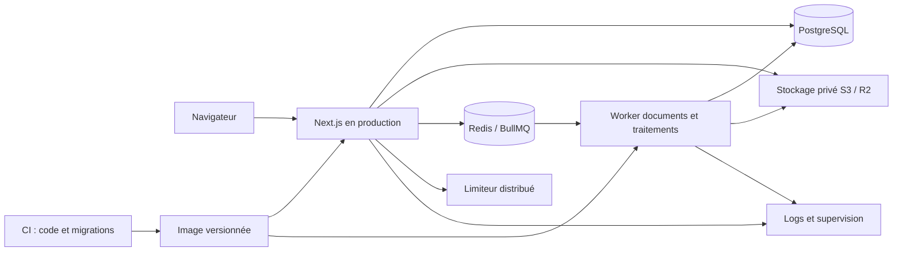

# Freelio — plan de préparation à une revue de CTO

Date : 30 septembre 2026. Objectif : obtenir des missions de sous-traitance comme développeur freelance, auprès d’agences encore à préciser. Ce document propose une trajectoire ; il ne constate pas la réalisation des travaux futurs et n’autorise aucune dépense, transmission à un fournisseur ou publication.

## 1. Résultat attendu

Freelio doit démontrer la capacité à concevoir, livrer, sécuriser et maintenir une application métier. Une agence doit pouvoir essayer trois parcours cohérents, examiner les choix techniques et reprendre le projet sans dépendre de la machine de son auteur.

Le positionnement recommandé est une application métier full stack de référence. Le domaine piscine/services sert de cas concret ; le dossier technique met en évidence les compétences transférables : React/Next.js, SQL, permissions, transactions, documents, tâches asynchrones, tests et exploitation.

Deux sorties distinctes évitent de confondre portfolio et exploitation commerciale :

- **V1 présentable à une agence** : application hébergée avec données fictives, parcours fiables, preuves de CI, documentation honnête, déploiement et récupération reproductibles.
- **Service accueillant de vrais clients** : validation supplémentaire des fournisseurs, contrats, responsabilités, données personnelles, volumes métier et obligations réglementaires. Cette seconde sortie n’est pas nécessaire pour commencer à présenter le portfolio.

Définition de réussite : un CTO découvre le cas d’usage en cinq minutes, examine un dossier technique en quinze minutes et peut vérifier les principales affirmations à partir d’un commit identifié.

## 2. Point de départ réellement établi

La dernière recette locale a réussi 427 tests dans 100 fichiers, le typage, le lint et un build Next.js. Une recette navigateur a vérifié 14 pages et 13 contrôles, avec création/modification d’un devis, dépense manuelle et justificatif PDF. Une restauration native SQLite dans une cible neuve a été effectuée. Gemini est retiré.

Ces résultats concernent le code local non commité et des données fictives. Ils ne prouvent pas la CI distante, le fonctionnement de PostgreSQL, une restauration R2/PostgreSQL, la charge, un audit exhaustif de sécurité ou tous les parcours métier. La preuve locale est `VERIFICATION-demo-completion-20260930-final.json` dans le dossier externe de recette ; les constats précédents restent historiques.

Points constatés dans le dépôt à traiter en premier :

| Constat | Conséquence pour la revue | Action |
| --- | --- | --- |
| README : ancien compteur de tests, badge Factur-X « Conforme », Node minimal ancien et lien distant | Des promesses ne sont pas reliées à la recette actuelle | Réviser le README, vérifier les liens et présenter explicitement la portée des preuves ; ne pas publier de badge de certification non étayé |
| Beaucoup de modifications locales et plusieurs plans historiques | Difficile d’identifier une livraison stable | Revue du diff, commits cohérents, version candidate et index documentaire ; conserver les historiques sans les présenter comme la validation courante |
| SQLite locale, PostgreSQL miroir et tests PostgreSQL non exécutés dans cette recette | Risque de différences SQL, transactions et migrations | Faire de PostgreSQL la référence de l’environnement partagé et de l’intégration |
| Aucun Dockerfile trouvé | Dépendance au poste et au packaging de l’hébergeur | Image de production et environnement de développement reproductibles |
| Auth.js `5.0.0-beta.30`, Prisma `6.12.0`, plusieurs SDK | Dette de dépendances à examiner | Inventaire, audit de sécurité, décisions documentées et mises à jour séparées |
| Connexions BullMQ configurées principalement par host/port | TLS, authentification et politique Redis managé à valider | Configuration Redis centralisée, secrets/TLS, limites de connexions et politique sans éviction |
| GitHub Actions appelle une adresse Vercel codée en dur ; traitements également présents dans le worker | Risque de mélange entre environnements et déclencheurs | Un ordonnanceur de référence, adresses configurées par environnement, reprise et idempotence prouvées |
| Le mode local exige une adresse fictive unique et utilise un garde-fou Node | Ce lanceur n’est pas une architecture de démo publique | Concevoir les comptes invités, les restrictions serveur et le reset des espaces de démonstration |

## 3. Décisions de technologies

| Élément | Recommandation | Justification et condition |
| --- | --- | --- |
| Next.js + React + TypeScript | Conserver | Déjà utilisés ; adaptés aux parcours serveur et client du projet. Aucun besoin établi de réécrire en Laravel, NestJS ou microservices |
| Architecture | Monolithe modulaire, web et worker séparés à l’exécution | Conserver les frontières finance, CRM, terrain, documents et migrations. Les transactions restent locales à la base. Extraire un service seulement pour un besoin d’isolation ou de charge mesuré |
| Node | Standardiser Node 24 LTS dans le poste, la CI et les images | La recette locale a utilisé Node 24 ; le dépôt/CI annonce encore 22. Vérifier toute la chaîne après alignement ; ne pas suivre une version Current pour ce seul motif [1] |
| Base | PostgreSQL comme référence commune | Développement reproductible, intégration, préproduction et démo hébergée avec le même moteur et les migrations versionnées. SQLite peut rester une commodité secondaire pour la démo locale |
| ORM | Garder Prisma, qualifier sa mise à jour majeure | Ne pas changer d’ORM par effet de mode. Étude bornée de la version stable maintenue et de la compatibilité des extensions de périmètre, transactions, drivers et TLS. La documentation annonce des ruptures majeures et une version actuelle plus récente que 6 ; toute version conservée doit avoir une justification de support et de sécurité [2] |
| Authentification | Garder Auth.js pendant la première stabilisation ; décision explicite ensuite | Examiner la beta utilisée, sa maintenance et les correctifs. Un essai Better Auth est pertinent si une version maintenue d’Auth.js ou les besoins de comptes invités ne conviennent pas. Pas de migration silencieuse : mots de passe, MFA, sessions, révocation et droits doivent rester équivalents [3] |
| UI | Conserver Tailwind et les composants existants | Auditer leur cohérence et accessibilité ; rationaliser les dépendances seulement après inventaire. Toute modification visible passe par un lot précis approuvé |
| PDF | Conserver Puppeteer/pdf-lib au départ | Valider les polices, Chrome, son isolation, les limites mémoire et la fermeture des processus dans le vrai runtime Linux. Ne pas supposer qu’une plateforme Docker accepte automatiquement la configuration sandbox de Chrome [4] |
| Asynchrone | Conserver BullMQ/Redis pour les travaux utiles | Tester retries, délais, reprise après arrêt, échec terminal et idempotence. Préférer un worker observable aux tâches métier dépendantes de GitHub Actions. BullMQ exige une politique Redis appropriée, notamment sans éviction [5] |
| Limitation des requêtes | Limiteur distribué en environnement public | Le code utilise aujourd’hui Upstash REST. Garder cette voie initialement ; mutualiser avec le Redis TCP du worker seulement après validation d’un adaptateur maintenu, atomicité et tests multi-instance. Ne pas considérer les deux APIs comme interchangeables |
| Documents | Conserver le stockage S3/R2 privé | Tester le vrai accès, les empreintes et la restauration. Les opérations S3 de versioning ne sont pas toutes prises en charge par R2 ; prévoir une copie indépendante des objets au lieu de promettre un versioning S3 implicite [6] |
| Tests | Conserver Vitest + Playwright | Améliorer la représentativité et les preuves, sans multiplier les outils de test |
| Hébergement | Qualifier une plateforme de conteneurs managée | Exemple à étudier : Render pour web, worker et PostgreSQL ; R2 pour les fichiers. Next peut être auto-hébergé sur Node/Docker. Le choix final dépend du test PDF, de la région, des sauvegardes et d’un budget réel [7][8] |

Pas de Kubernetes, de nouvelle couche GraphQL, de message broker supplémentaire ou d’IA dans la V1 sans problème mesuré. Chaque changement de technologie produit une courte décision : problème, options, coût de migration, preuve attendue et retour arrière.

## 4. Architecture cible et environnements

Ce schéma est une cible : certaines routes PDF rendent aujourd’hui le document de manière synchrone. Tester les chemins synchrones et asynchrones ; déplacer un rendu dans la file seulement si le bénéfice est établi, avec adaptation visible approuvée si nécessaire.

Trois environnements distincts : développement isolé, préproduction de recette et démo publique. Bases, buckets, clés et destinations sont séparés. Aucune réutilisation d’un `.env` local privé. Les variables de build publiques et les variables serveur sont distinguées ; le flag de texte de démo n’est jamais une autorisation serveur.

Le build produit une image identifiée, avec versions verrouillées et sans secret incorporé. Les migrations s’exécutent dans une étape contrôlée avant mise en service. Les changements SQL suivent une stratégie compatible avec la version précédente lorsque possible ; revenir à l’image précédente ne suffit pas à annuler une migration destructive.

## 5. Ordre de réalisation et conditions de sortie

Les charges ci-dessous sont des ordres de grandeur pour un développeur connaissant le projet. Elles sont recalibrées après la première étape. Une condition de sortie non satisfaite bloque le jalon suivant ; elle ne se transforme pas en validation implicite à la fin du délai.

| Étape | Travail et livrables | Condition de sortie | Charge indicative |
| --- | --- | --- | --- |
| 0 — Stabiliser une référence | Revue de tout le diff, traçabilité des travaux préexistants, scan de secrets sans publication, inventaire dépendances/licences, README vérifiable, commits par lot, index des rapports | Checkout identifié, aucune clé/base dans les fichiers à publier, affirmations reliées à leur preuve ou marquées non vérifiées | 1–2 jours |
| 1 — Rendre le projet reproductible | Node unique, Docker/Compose avec PostgreSQL et Redis, préparation et fixtures dédiées, validation des variables, build Linux avec Chrome/polices, séparation migrations/build/démarrage | Un checkout neuf démarre sans modification de code ni secret de production ; PDF réel fonctionne ; une configuration invalide échoue avec un diagnostic exploitable | 2–4 jours |
| 2 — Décider les dépendances | Audit actuel, essai de mise à jour Prisma, décision Auth.js/Better Auth, dépendances inutilisées, validation Redis TLS et fonctionnement worker | Aucun défaut de dépendance critique/élevé exploitable non traité ; décisions motivées ; modifications indépendantes avec régression et retour arrière | 2–5 jours |
| 3 — Prouver les invariants métier et sécurité | Tests PostgreSQL réels et migrations depuis une base vide + une version précédente, matrice entreprise/agence/rôle, tests d’échecs et concurrence, E2E production | Aucune fuite entre entreprises ; calculs et archives stables ; mêmes preuves dans la CI sur le SHA candidat ; sorties réseau simulées dans les tests | 4–6 jours |
| 4 — Construire la démo hébergée | Jeu de données cohérent, comptes invités, restrictions serveur, quotas et expiration/reset bornés, services externes neutralisés, déploiement de préproduction | Deux visiteurs indépendants ne modifient pas leurs espaces mutuels ; compte démo ne peut pas administrer l’infrastructure ni provoquer un envoi réel ; parcours vedettes sans impasse | 2–4 jours |
| 5 — Mesurer et préparer l’exploitation | Profils SQL, charge et PDF, revue clavier/mobile, erreurs et métriques, sauvegarde native PostgreSQL + objets + clés, restauration et rollback chronométrés | Budgets tenus sur configuration décrite ; panne détectée et reprise démontrée ; aucune mention de SLA non mesuré | 3–5 jours |
| 6 — Préparer la revue d’agence | Cas d’étude, schéma architecture, décisions, carte de tests, vidéo courte, script démo, guide contribution, revue CTO à blanc | Un tiers peut installer, comprendre et vérifier ; tu peux expliquer et modifier un flux critique ; objections et limites sont documentées | 2–3 jours |

Total initial : **16–29 jours de travail**, hors délais de comptes fournisseurs, corrections imprévues ou refonte fonctionnelle. Première présentation privée possible dès que les étapes 0–3 passent, avec vidéo/démo locale si l’hébergement n’est pas prêt. Cette fourchette n’est pas une promesse calendaire.

## 6. Trois parcours à défendre intégralement

1. **Vente vers facturation** : client fictif → devis versionné avec remise/TVA → acceptation → document commercial/facture de démonstration → archive PDF/XML → règlement fictif. Montrer une correction et un refus de modification d’un document émis. Aucune émission réglementaire ou paiement externe réel.
2. **Intervention métier** : équipement → ticket → planification → intervention → photo/justificatif → rapport. Ajouter un scénario hors ligne et reprise uniquement si la synchronisation, les doublons et les conflits ont des preuves.
3. **Données et récupération** : import fictif → simulation → import → interruption/reprise → rapprochement → export → restauration dans une cible neuve. Inclure un fichier altéré et un mapping erroné pour montrer le refus explicite.

Chaque parcours dispose d’une fixture déterministe, d’un test E2E, d’un test d’autorisation, d’un chemin d’erreur et d’une courte explication de ses invariants. Les fonctions périphériques restent documentées avec leur état réel. La V1 fige l’ajout de modules ; elle ne promet pas de remplacer intégralement un ERP ou de certifier la facturation.

## 7. Sécurité et démo publique

Construire une revue fondée sur les exigences pertinentes d’OWASP ASVS, avec statut « vérifié / non applicable / restant » et référence versionnée. Cela fournit un cadre de vérification, pas une certification [9].

Inventorier toutes les routes, Server Actions, jobs et webhooks exposés, y compris les modules qui ne figurent pas dans les trois parcours vedettes. Masquer une entrée de navigation ne désactive pas son action serveur. Une fonctionnalité exclue de la démo publique doit aussi être refusée côté serveur ou réservée à un rôle approprié.

| Risque | Preuve exigée |
| --- | --- |
| Lecture/écriture entre entreprises ou agences | Deux entreprises, plusieurs rôles ; appels directs aux Server Actions/routes et fichiers, IDs échangés, recherche/export, traitements de fond, révocation de membre |
| Accès sans authentification ou droits | Sessions expirées, mots de passe incorrects, MFA/recovery à usage unique, absence de bypass dev/CI sur le serveur publié, protections CSRF/origine et cookies vérifiées |
| Réseau et fichiers | Uploads falsifiés/surdimensionnés, noms et chemins malveillants, SSRF/redirect/DNS, PDF sans ressources arbitraires ; limites CPU/mémoire/délai et nettoyage temporaire |
| Exécution sans contexte | Inventaire SQL brut, transactions, jobs et webhooks ; périmètre tenant explicite lorsque le contexte de requête n’existe pas ; tests contre une vraie base |
| Abus de la démo | Compte public en lecture seule pour la découverte ; espaces modifiables séparés sur invitation, quotas de données et fichiers, durée bornée, reset ciblé et verrouillé |
| Effets externes | Adaptateurs de démonstration serveur ; clés d’envoi/paiement/import externe absentes ; une simulation n’est pas journalisée comme un envoi réel réussi |
| Secrets et chaîne de livraison | Scan fichiers/historique à publier, secrets hors image, droits minimaux, rotation, audit npm actualisé et tri des vulnérabilités réellement exposées |
| Confidentialité et logs | Pas de mot de passe, jeton, pièce ou coordonnées personnelles dans les traces ; collecte minimale même si les dossiers métier sont fictifs ; politique exacte pour un site public |

L’accès public en lecture seule est la voie initiale recommandée. Les essais de modification peuvent être fournis à un CTO invité dans son propre espace, sans exiger une plateforme complexe de création de tenants anonymes. Aucun reset général d’une base partagée.

## 8. Qualité, performances et exploitation

- **Tests** : séparer fonctions pures, autorisations simulées, intégration SQL, contrats des fournisseurs et E2E. Le nombre 427 ne remplace pas une carte des risques. Garder la couverture mesurée des modules critiques et traiter les branches d’échec réellement manquantes.
- **PostgreSQL** : prouver numérotation concurrente, transaction/rollback, baux d’import, réservation de stock, paiement en double et précision financière. Les tests SQLite ne sont pas une substitution. Aucun `db push` contre l’environnement partagé.
- **CI/CD** : `npm ci` sur checkout propre, génération, migrations, typage, lint, audit, tests et E2E Linux/PostgreSQL. Décrire les tests volontairement ignorés. Publier SHA, version Node, traces, coverage et digest d’image. Déployer seulement une version passée, puis smoke test et rollback.
- **Dépendances** : versions exactes résolues par lockfile, mises à jour automatisées regroupées raisonnablement, compatibilité Chromium/SDK vérifiée ; politique d’exception datée si une vulnérabilité ne peut pas être corrigée immédiatement.
- **Code** : réduire les `any` et les conversions forcées sur les frontières auth, finance, imports et fichiers ; valider les entrées serveur ; maintenir une séparation entre orchestration et règles pures. Refactoriser un module seulement avec un invariant ou une difficulté démontrée.
- **Mesures** : budgets initiaux proposés, non encore mesurés : p95 des lectures serveur sous 800 ms, pas d’attente UI habituelle supérieure à 2 s après chauffe, zéro erreur métier/5xx sur 30 minutes à 10 sessions concurrentes et corpus de 10 000 dossiers synthétiques. Tester les PDF séparément avec une concurrence initiale de 1–2, temps limite et mémoire maximum. Enregistrer matériel, région, corpus et exclusions ; ajuster les budgets si le cas d’usage le justifie.
- **Accessibilité** : clavier, focus, formulaires, messages d’erreur, contraste et lecteurs d’écran sur les trois parcours ; contrôles automatiques et vérifications manuelles. Un score Lighthouse ne vaut pas certification.
- **Supervision** : erreurs corrélées à une requête/version sans données sensibles, état du worker et ancienneté des jobs, échecs de sauvegarde, disponibilité et alerte testée. Un humain identifié reçoit les alertes lorsque l’environnement existe.
- **PRA** : exercice PostgreSQL + objets dans un environnement neuf, avec clés de chiffrement, relations, montants et empreintes contrôlés. Cible indicative de démo : perte de modifications fictives inférieure à 24 h et reprise sous 2 h ; mesurer avant de l’annoncer. Le jeu initial reproductible réduit la dépendance au dernier état de la démo.
- **Coût** : devis mensuel explicite pour web, worker, PostgreSQL, Redis/limiteur, objets, supervision, sauvegardes, domaine et environnements. Plafonds, quotas et consommation observée ; aucun calcul fondé sur des offres gratuites supposées pérennes.

## 9. Dossier à remettre ou montrer au CTO

| Livrable | Ce qu’il doit permettre de vérifier |
| --- | --- |
| README court avec installation, cas d’usage et limites | Comprendre ce qui est livré et reproduire un démarrage |
| Schéma architecture + modèle de données simplifié | Comprendre entreprise/agence, flux financiers, jobs et documents |
| 5–8 décisions d’architecture | Discuter monolithe, PostgreSQL, ORM, auth, centimes, archive immuable, asynchrone et infrastructure |
| Carte risques → tests → CI → version | Vérifier une affirmation sans se fier à un compteur de tests |
| Guide contribution, convention de commits et exemples de PR | Évaluer la capacité à travailler dans une équipe d’agence |
| Runbook de déploiement, incident et restauration | Mesurer le degré d’autonomie et la reprise par un autre développeur |
| Cas d’étude avec captures approuvées et vidéo 3–5 minutes | Présenter problème, décisions, résultat et limites, sans inventer de client ou de gains chiffrés |
| Présentation technique 15–20 minutes et exercice de modification | Montrer la compréhension du code, du debugging et des conséquences d’un changement |

La présentation doit distinguer les travaux personnels, les bibliothèques et l’assistance éventuelle d’outils de génération. L’argument décisif est la capacité à expliquer, tester et maintenir le résultat. La licence du code propre et celles des dépendances/assets sont décidées avant partage ; un dépôt privé accessible sur invitation est une option.

Questions à préparer : pourquoi Next plutôt qu’un backend séparé ? Où est contrôlé le tenant ? Que se passe-t-il si le worker redémarre au milieu d’un PDF ? Comment éviter deux factures avec le même numéro ? Que restaure-t-on après perte de la base ? Quels tests parlent réellement à PostgreSQL ? Quelle est la limite de montée en charge ? Quel module serait extrait en premier, et sur quelle mesure ?

## 10. Registre des validations visibles et décisions externes

Les choix techniques réversibles peuvent être préparés sans modifier l’interface. Avant application, soumettre les lots visibles précisément :

| Lot proposé | Description à faire approuver |
| --- | --- |
| Présentation publique | Réviser les promesses commerciales, supprimer les mentions de certification non étayées, présenter le projet comme cas d’étude freelance |
| Accès démo | Ajouter ou modifier les invitations à explorer et l’accès lecture seule ; état des actions interdites et comptes invités |
| Parcours vedettes | Réduire/reclasser les entrées de navigation si nécessaire ; écrans d’aide et états d’erreur/loading |
| Documents et données | Ajouter une mention de démonstration aux documents publics, enrichir les fixtures visibles avec des cas crédibles |
| Accessibilité | Modifications concrètes de contraste, focus, libellés, dimensions ou disposition selon les résultats de recette |
| Cadre public | Adapter confidentialité/conditions au site hébergé ; la formulation actuelle d’instance locale ne suffit pas pour le site public |

Avant ouverture publique : présenter une préproduction consultable et le coût total, puis faire valider l’hébergeur, la région, le budget, le domaine et la publication. Le dépôt local et la démo actuelle continuent de fonctionner pendant cette préparation. Le plan ne déclenche aucun envoi d’e-mail, achat ou déploiement.

## 11. Critère final « présentable et défendable »

La V1 peut être montrée lorsque les trois parcours passent sur le serveur de production de recette, que les tests et migrations PostgreSQL sont verts sur le commit publié, que l’isolation des visiteurs et les restrictions de démo sont prouvées, que restauration et rollback ont été exécutés, et que le dossier technique reflète exactement ces preuves.

Les défauts bloquants : fuite de données/droits, corruption ou montants incorrects, mutation non autorisée d’une archive, parcours principal cassé, perte non maîtrisée, promesse technique fausse ou déploiement non reproductible. Un défaut périphérique peut rester dans un backlog explicite s’il ne compromet pas la démonstration ni sa sécurité.

Première action d’exécution : stabiliser la référence Git et le README, puis rendre PostgreSQL et le runtime Linux reproductibles. Toute nouvelle fonctionnalité attend la validation de ce socle.

## Références vérifiées le 30 septembre 2026

[1] [Calendrier officiel Node.js](https://github.com/nodejs/Release) — statut LTS et horizons de maintenance.

[2] [Guide de migration Prisma](https://www.prisma.io/docs/guides/upgrade-prisma-orm/v7) — ruptures de générateur, configuration, drivers/pools et TLS ; le guide signale Prisma 8 comme version actuelle. Revalider la version précise au moment de l’essai.

[3] [Guide officiel Auth.js → Better Auth](https://better-auth.com/docs/guides/next-auth-migration-guide) — migration à planifier, pas d’urgence déclarée pour une installation qui fonctionne.

[4] [Puppeteer et Docker](https://pptr.dev/guides/docker) — dépendances Chrome, init et exigences de sandbox de l’image proposée.

[5] [Connexions BullMQ](https://docs.bullmq.io/guide/connections) — différences producer/worker, retries et politique Redis `noeviction`.

[6] [Compatibilité S3 de R2](https://developers.cloudflare.com/r2/api/s3/api/) — opérations prises en charge et limites, notamment `PutBucketVersioning` non implémenté.

[7] [Auto-hébergement Next.js](https://nextjs.org/docs/app/guides/self-hosting) — exploitation Node/Docker, configuration et contraintes d’environnement.

[8] [Docker sur Render](https://render.com/docs/docker), [workers](https://render.com/docs/background-workers) et [restauration PostgreSQL](https://render.com/docs/postgresql-backups) — capacités à qualifier pour ce projet, sans garantie d’adéquation au renderer Chrome.

[9] [OWASP ASVS](https://owasp.org/projects/asvs) — référentiel de contrôles et preuves de sécurité applicative.
