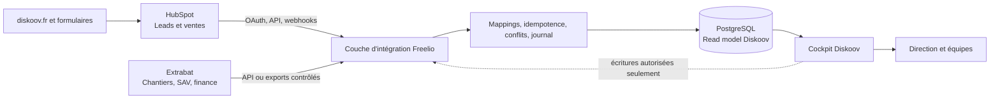

# Audit CRM Diskoov et feuille de route d'adaptation de Freelio

> **Document d'audit préliminaire — stratégie remplacée.** Après clarification, l'objectif est de supprimer les abonnements HubSpot et Extrabat. La stratégie de référence est désormais le [plan directeur de remplacement complet](./diskoov-crm-replacement-master-plan.md). Le présent document reste utile pour l'inventaire technique et les recherches fonctionnelles détaillées, mais sa recommandation de coexistence ne doit plus guider le projet.

Date de l'audit : 23 août 2026  
Périmètre : dépôt local `CRM-Freelio v2`, activité publique de Diskoov, documentation publique Extrabat Piscine et documentation officielle HubSpot.  
Décision couverte : définir ce qu'il faut conserver, intégrer, adapter ou arrêter avant toute implémentation.

## 1. Synthèse dirigeant

Freelio dispose déjà d'un socle fonctionnel sérieux : CRM client, pipeline, projets, organisation, devis, contrats, signature, factures, règlements, relances, récurrence, temps, dépenses avec OCR, rapprochement bancaire, PDF/Factur-X, sauvegardes, conformité et notifications.

La bonne stratégie pour Diskoov n'est cependant pas de recréer Extrabat et HubSpot dans un troisième outil. Cela produirait trois sources de vérité, plus de doubles saisies et des conflits difficiles à résoudre.

La cible recommandée est :

- HubSpot reste le maître des prospects, contacts marketing, sources d'acquisition, activités commerciales, transactions et prévisions de vente.
- Extrabat reste le maître des dossiers clients opérationnels, devis et commandes, chantiers, planning terrain, fournisseurs, équipements, SAV, contrats de service, facturation et comptabilité.
- Freelio devient le cockpit Diskoov : dossier client à 360 degrés, lecture croisée HubSpot/Extrabat, suivi du parcours complet, indicateurs de direction, alertes, qualité des données et quelques objets Diskoov réellement absents des deux outils.

Le projet recommandé se mène en deux paliers :

1. MVP en lecture seule et données réconciliées, en 10 à 14 semaines sous réserve d'accès aux données et API.
2. Cible complète avec écritures contrôlées, automatismes et pilote terrain, en 16 à 24 semaines au total.

Une tentative de remplacement intégral d'Extrabat et HubSpot représenterait plutôt 9 à 15 mois, avec un risque fort sur le SAV, la comptabilité, le planning, les catalogues fournisseurs, les campagnes et la qualité des données. Ce scénario n'est pas recommandé.

## 2. Limites de l'audit et prochaine preuve nécessaire

L'audit d'Extrabat et de HubSpot ci-dessous porte sur leurs capacités publiques actuelles. Il ne peut pas révéler la configuration réelle de Diskoov : abonnements, modules activés, propriétés personnalisées, pipelines, workflows, modèles, droits, intégrations, volume et qualité des données.

Avant de coder l'intégration, il faut donc réaliser un audit administrateur des deux comptes. Aucun mapping définitif ni promesse de synchronisation ne doit être validé avant cette étape.

Sources principales :

- [Site public Diskoov](https://diskoov.fr/)
- [Extrabat Piscine](https://www.extrabat.com/piscine/)
- [Brochure officielle Extrabat Piscine 2025](https://www.extrabat.com/wp-content/uploads/2025/08/EXTRABAT-plaquette-piscine_web_2025.pdf)
- [Ressources et liste de fonctionnalités Extrabat](https://www.extrabat.com/ressources/)
- [Comprendre les objets HubSpot](https://knowledge.hubspot.com/fr/records/understand-objects)
- [Générer des ventes avec HubSpot](https://knowledge.hubspot.com/fr/get-started/generate-sales)
- [Types de workflows HubSpot](https://knowledge.hubspot.com/fr/workflows/understand-workflow-object-types)
- [Qualité des données HubSpot](https://knowledge.hubspot.com/fr/data-management/use-data-quality-tools)
- [Architecture des API CRM HubSpot](https://developers.hubspot.com/docs/api-reference/latest/crm/understanding-the-crm)
- [Webhooks HubSpot](https://developers.hubspot.com/docs/api-reference/latest/webhooks/guide)

## 3. Existant Freelio : inventaire vérifié

### 3.1 Empreinte technique

Le dépôt contient actuellement :

- 38 pages Next.js ;
- 8 routes API ;
- 108 Server Actions exportées ;
- 48 modèles Prisma ;
- 72 composants client ;
- 7 fichiers de tests unitaires, soit 30 tests exécutés avec succès ;
- une suite Playwright desktop et mobile de 10 scénarios déclarés.

Socle technique :

- Next.js 16.2.10, React 19.2 et TypeScript strict ;
- Prisma 6.2 avec SQLite ;
- Auth.js/NextAuth avec lien magique Resend et session JWT ;
- Tailwind CSS 4, Base UI et composants internes ;
- Zod pour les validations métier ;
- génération PDF avec Puppeteer/PDF-lib, Factur-X et trois modèles de document ;
- stockage local de fichiers avec empreinte SHA-256 ;
- BullMQ/Redis pour les files de génération et d'e-mails ;
- Gemini pour l'OCR de justificatifs ;
- sauvegarde/restauration locale et export de données ;
- en-têtes CSP, HSTS, anti-framing et rate limiting.

### 3.2 Modules fonctionnels réellement présents

| Domaine | Fonctions présentes | Niveau actuel |
|---|---|---|
| Authentification et société | Connexion par e-mail, onboarding, identité légale, SIRET, TVA, IBAN chiffré, logo, couleur, modèles PDF | Présent, mono-utilisateur |
| Tableau de bord | CA encaissé, encours, clients, projets, seuil de TVA, URSSAF estimé, priorités, temps non facturé, relances, charge et projets à risque | Solide pour un freelance, à reverticaliser |
| Clients | Entreprise/particulier, contacts, coordonnées, CA, impayé, score relation, prochaine action, journal manuel, documents | Présent mais peu profond pour Diskoov |
| Pipeline | Pipeline Kanban, étapes personnalisables, opportunité, valeur, probabilité, gagné/perdu | Présent mais très en dessous de HubSpot |
| Projets | Budget, consommé, dates, statut, jalons, critères de recette, fichiers, temps et dépenses | Présent mais orienté mission numérique |
| Registre technique | Dépôt Git, production, staging, hébergeur, stack, domaine | Inadapté au métier Diskoov |
| Organisation | Objectifs jour/semaine/mois/année, tâches, priorités, catégories, dates, récurrence, lien client/projet, export calendrier ICS | Présent et réutilisable |
| Catalogue | Catégories et services, code, libellé, prix, unité, TVA | Présent, sans produits/fournisseurs/stock |
| Devis | Numérotation, versions, sections, lignes, TVA, PDF, statuts, conversion en facture ou contrat | Solide mais en doublon potentiel avec Extrabat |
| Contrats | Modèles, clauses, variables, PDF, statuts, validité, signature manuscrite et piste d'audit | Présent, flux externe à sécuriser |
| Factures | Standard/acompte/avoir, verrouillage après émission, paiements, relances, récurrence, temps non facturé, PDF, Factur-X | Solide mais en doublon potentiel avec Extrabat |
| Dépenses | Catégorie, fournisseur, TVA, justificatifs, OCR, lien client/projet | Présent |
| Banque/comptabilité | Import CSV, dédoublonnage, rapprochement facture/dépense, création de dépense depuis une transaction, synthèse comptable | Partiel |
| Notifications | Centre de notifications, lecture/suppression | Présent |
| Recherche | Recherche globale clients, projets, devis et factures | Présent |
| Conformité | Journal d'audit, export des données, anonymisation, sauvegarde/restauration | Base présente |
| Intégrations | Modèles de clés API, webhooks et livraisons | Modèle dormant, aucune intégration HubSpot/Extrabat |
| E-facturation | État de préparation, journal, Factur-X, champs PDP | Préparé mais non connecté à une plateforme réelle |

### 3.3 Ce qui est particulièrement réutilisable

- Le shell applicatif, la navigation responsive, les thèmes et les composants de formulaire.
- Les patterns Server Components/Server Actions et le filtrage par `companyId` dans la majorité des actions.
- Les composants de liste, de recherche, d'état vide, de chargement et d'erreur.
- Le moteur de tâches/objectifs et le cockpit d'alertes.
- Le moteur de documents, de PDF, de numérotation et de contrôle qualité.
- L'import CSV, le mécanisme de dédoublonnage et les files BullMQ.
- Les journaux d'audit, sauvegardes, empreintes de fichiers et briques de chiffrement.
- Les tests métier de numérotation, PDF, Factur-X et workflows.

### 3.4 Ce qui ne doit pas être conservé tel quel

- La relation `User.companyId` unique impose un utilisateur par société. Diskoov a besoin de membres, équipes, rôles et affectations.
- SQLite et le stockage local ne conviennent pas à une application toujours active recevant des webhooks et utilisée simultanément par une équipe.
- `ProjectTechnicalProfile` est conçu pour des projets web et doit être remplacé par un profil d'installation/bassin/équipement.
- Les opportunités n'ont ni propriétaire, ni source, ni date de clôture, ni raison de perte, ni catégorie de prévision, ni historique commercial synchronisé.
- Les adresses sont stockées dans un seul champ. Diskoov a besoin de plusieurs sites, adresses structurées et coordonnées géographiques.
- Les statuts sont majoritairement des chaînes libres. Les transitions et droits ne sont pas formalisés.
- Les modèles `WebhookEndpoint` et `ApiKey` ne sont reliés à aucun parcours de configuration ni connecteur.
- Aucun objet n'existe pour les fournisseurs, commandes, bons de livraison, stock, techniciens, tournées, interventions, équipements, numéros de série, garanties, SAV ou fabricants.
- Les devis, factures et contrats internes risquent de concurrencer Extrabat. Ils doivent être classés en « source locale autorisée », « miroir externe » ou « abandonné » avant adaptation.

## 4. État de santé technique et UX

### 4.1 Score d'audit interface

| Dimension | Score /4 | Constat principal |
|---|---:|---|
| Accessibilité | 2 | Bonne base sémantique, mais de nombreuses actions à 24 px sont trop petites pour le tactile et plusieurs formulaires restent à relier explicitement à leurs labels |
| Performance | 3 | Reads serveur, chargements parallèles et polices locales ; plusieurs vues métier sont toutefois de gros composants client |
| Responsive | 3 | Shell mobile, sidebar dédiée et pipeline scrollable ; les tables et actions compactes doivent être éprouvées sur le terrain |
| Thème | 3 | Tokens light/dark cohérents ; quelques couleurs sémantiques et variantes de bouton restent codées en dur |
| Anti-patterns | 3 | Interface sobre ; le détecteur relève six accents de bordure ou animations discutables, dont peu concernent le coeur du CRM |
| **Total** | **14/20** | **Bon socle, à durcir avant intégration** |

Verdict anti-patterns : l'application ne ressemble pas à une galerie générique générée par IA. La hiérarchie est familière et crédible pour un outil métier. Les écarts visuels détectés sont ponctuels.

### 4.2 Contrôles exécutés

- `npm test -- --run` : 30/30 tests unitaires réussis.
- `npm run lint` : réussi sans erreur.
- `npm run build` : compilation réussie, puis échec du type-check sur un fichier généré corrompu `.next/dev/types/routes.d.ts:112`.
- La suite Playwright existe, mais son exécution complète n'a pas été obtenue durant l'audit : le serveur de développement est resté bloqué lors de la première compilation de `/auth/login` et le run a été interrompu.

### 4.3 Problèmes priorisés

#### P1 - Bloquants avant une version Diskoov

1. **Build non reproductible**  
   Localisation : `tsconfig.json`, `.next/dev/types/routes.d.ts:112`.  
   Impact : impossible de certifier un artefact de production.  
   Action : nettoyer/régénérer les types Next.js, séparer les artefacts dev du contrôle de production et rendre le build obligatoire en CI.

2. **Architecture mono-utilisateur**  
   Localisation : `prisma/schema.prisma`, relation `User.companyId @unique` et `Company.user`.  
   Impact : pas de gérant, commerciaux, techniciens, back-office ni droits par rôle.  
   Action : introduire `Organization`, `Membership`, `Team`, rôles et permissions, puis migrer vers PostgreSQL.

3. **Flux de signature contradictoire**  
   Localisation : `src/actions/contrats/index.ts:204` et `src/app/dashboard/contrats/[id]/sign/page.tsx:12`.  
   Impact : la page est sous `/dashboard` et demande une authentification, tandis que l'action se déclare publique et signe à partir du seul identifiant du contrat.  
   Action : route publique dédiée, jeton signé à durée de vie limitée, usage unique, validation serveur, transaction atomique et rate limiting.

4. **Aucune gouvernance de synchronisation**  
   Localisation : absence de connecteurs et de tables de mapping malgré les modèles génériques.  
   Impact : toute intégration immédiate créerait des doublons et des conflits silencieux.  
   Action : valider la matrice des sources de vérité avant la première écriture externe.

#### P2 - Importants pour le MVP

5. Modèle métier encore « freelance numérique », sans installation, bassin, produit configuré, équipement, garantie, intervention ou SAV.
6. Vingt occurrences de contrôles ou éléments compacts de 24 px ont été détectées ; les actions terrain doivent viser au moins 44 x 44 px.
7. Plusieurs grandes surfaces interactives sont entièrement client, notamment Organisation ; les découper limitera le bundle et les rerenders.
8. Les objets API/webhooks sont dormants et ne couvrent ni OAuth, ni curseurs, ni idempotence, ni conflits, ni rejouabilité.
9. Aucun dossier `prisma/migrations` n'est présent ; la stratégie de migration et de retour arrière doit être créée avant la première donnée Diskoov.

#### P3 - Finition

10. Six anti-patterns visuels détectés : bordures d'accent latérales/supérieures et une animation `bounce`.
11. Le README est encore celui de `create-next-app` et ne décrit ni le produit, ni l'exploitation, ni les responsabilités de données.

### 4.4 Points positifs à préserver

- Authentification vérifiée dans les Server Actions et filtrage par société largement appliqué.
- Validations Zod, factures verrouillées après émission et corrections par avoir.
- Récupération parallèle des données du tableau de bord.
- Fichiers de chargement et d'erreur sur les principaux segments.
- Navigation mobile, lien d'évitement, focus visible, thème sombre et réduction de mouvement.
- CSP, HSTS, chiffrement de l'IBAN, rate limits, audit log et sauvegardes.

## 5. Diskoov : lecture métier publique

Diskoov est une entreprise créée en 2021 et dirigée par Xavier Dispot. Elle vend et accompagne l'installation de solutions premium de protection de piscine dans les régions PACA, Occitanie et Rhône-Alpes, avec showroom Coverseal sur rendez-vous.

Offre visible :

- Coverseal ;
- Oré ;
- Eden ;
- volets hors-sol et immergés ;
- bâches quatre saisons ;
- abris télescopiques ;
- PoolDeck.

Promesse opérationnelle visible : expertise produit et implantation à domicile, prix direct usine, visite technique et pose incluses, SAV réactif, maîtrise d'ouvrage si nécessaire. Pour Coverseal, le site indique aussi une visite technique définitive, une livraison, une installation, des garanties et un SAV assurés avec le fabricant.

Le parcours métier à représenter est donc plus riche qu'une transaction commerciale :

1. Demande de devis et qualification.
2. Premier contact et choix de solution.
3. Rendez-vous/visite d'implantation.
4. Faisabilité, mesures, photos et configuration.
5. Devis et arbitrages.
6. Signature et acompte.
7. Validation fabricant et commande usine.
8. Planification livraison/pose.
9. Installation, réception et documents.
10. Équipement, garantie, entretien et SAV.
11. Satisfaction, avis, recommandation et renouvellement.

## 6. Audit Extrabat Piscine

Extrabat annonce 16 modules et plus de 200 fonctions. La liste officielle téléchargeable numérote 211 capacités. La brochure 2025 met en avant plus de 70 catalogues fournisseurs, la mobilité et l'automatisation après signature d'un devis.

### 6.1 Couverture fonctionnelle

| Module Extrabat | Capacités déterminantes pour Diskoov |
|---|---|
| Gestion client/CRM | Import clients/prospects, portefeuille commercial, indicateurs client, historique ventes/SAV/échanges, géolocalisation, rappels, formulaires de qualification, documents et messagerie |
| Gestion commerciale | Devis, commandes, BL, factures, avoirs, achats, règlements, remises en banque, relances, commandes fournisseurs, commissions, stocks, marge et avancement |
| Générateur de documents | Dossiers d'offre, CGV et attestations, colonnes personnalisées, mentions et contacts du projet |
| Articles fournisseurs | Catalogues métiers, garanties, durée de vie/récurrence, familles, mouvements et affectations de stock |
| Comptabilité | Journaux, factures d'achat, lettrage, rapprochement, relevés, FEC et exports comptables |
| Signature électronique | Signature distante de documents commerciaux et PDF, horodatage, certificat et tiers de confiance |
| Agenda | Agendas synchronisés, rendez-vous, typologies, rappels SMS/e-mail, rapports de visite, géolocalisation et itinéraires |
| Chantiers | Modèles de projets et tâches, agenda, affectations, workflow, capacité des équipes et reste à faire |
| SAV | Pré-diagnostic, formulaires techniciens, planification, rappels, signature hors connexion, statut, historique et coût de garantie |
| Contrats de service | Interventions récurrentes, formulaires, rappels d'échéance, statut à facturer et historique client |
| SMS et emailing | Relance devis, renouvellements produits, campagnes, rappel de rendez-vous et message « je pars » |
| Géolocalisation | Clients, prospects, SAV, contrats, articles installés, rendez-vous et optimisation de tournées |
| Bibliothèque | GED, arborescence, notices liées aux articles, partage client et mobile |
| Caisse | Tickets, retours, encaissements, avoirs, client et matériel de caisse |
| Espace client | Messagerie, projet, équipements, planning, devis/factures/commandes, photos, documents et évaluation |
| Statistiques/exports | Rendez-vous, canaux, SAV, contrats, ventes, facturation, objectifs, CA vendeur, heures et exports ; extension API mentionnée |

### 6.2 Forces pour Diskoov

- Profondeur métier piscine déjà très supérieure à Freelio.
- Devis signé pouvant déclencher tâches, planning, commandes fournisseurs, garanties, dossier SAV, communication et prévision de facturation.
- Gestion terrain et hors connexion.
- Équipements/articles installés, cycles de renouvellement et garanties.
- Catalogues fournisseurs, stocks, achats, BL et caisse.
- Planning, capacité, géolocalisation et tournées.
- SAV et contrat de service documentés, signés et reliés au client.
- Portail client et bibliothèque de documents.

### 6.3 Faiblesses ou points à vérifier

- La documentation publique ne donne pas le contrat d'API, les endpoints, quotas, webhooks, coûts ou droits d'écriture.
- Une « extension API Extrabat » est mentionnée, mais son accès doit être confirmé commercialement et techniquement.
- L'usage exact de HubSpot par Diskoov peut déjà dupliquer clients, activités, campagnes et pipeline.
- La configuration réelle des workflows, familles SAV, modèles de chantier et catalogues n'est pas visible publiquement.
- Il faut vérifier les capacités d'export incrémental, les identifiants stables et les dates de modification.

Conclusion Extrabat : ne pas reproduire ses fonctions de chantier, SAV, stock, fournisseurs ou comptabilité dans Freelio sans preuve d'un manque précis.

## 7. Audit HubSpot

HubSpot organise le CRM autour d'objets, propriétés et associations. Les objets standards couvrent notamment contacts, entreprises, leads, transactions, tickets, activités, produits, lignes, devis, factures, paiements, abonnements et conversations. Les fonctions disponibles dépendent fortement des Hubs et niveaux d'abonnement.

### 7.1 Couverture fonctionnelle pertinente

| Domaine HubSpot | Capacités déterminantes pour Diskoov |
|---|---|
| Données CRM | Contacts, entreprises, transactions, leads, propriétés, associations bidirectionnelles, vues et fiches personnalisées |
| Acquisition | Formulaires, chat, campagnes, publicités, sources, listes, scoring, lifecycle et consentements marketing |
| Vente | Pipelines, étapes, propriétaires, tâches, e-mails, appels, réunions, modèles, séquences, prévisions et objectifs |
| Automatisation | Workflows par objet, création/mise à jour de fiches, tâches, notifications, branches et actions inter-objets selon abonnement |
| Commerce | Produits, lignes, devis, factures, paiements et abonnements selon configuration |
| Service | Tickets, centre de support, boîte de réception, portail client, base de connaissances, enquêtes et analytics selon abonnement |
| Reporting | Tableaux de bord, rapports multi-objets, attribution, prévisions, objectifs et progression |
| Qualité des données | Doublons, problèmes de format, propriétés inutilisées/vides, règles et résumés de qualité selon abonnement |
| Extension | Propriétés personnalisées, pipelines, objets personnalisés en Enterprise, API CRM, imports, OAuth et webhooks |

### 7.2 Forces pour Diskoov

- Meilleur choix pour l'origine des leads et l'historique marketing/commercial.
- Pipelines, propriétaires, activités et prévisions plus riches que le pipeline actuel de Freelio.
- Automatisation des relances, tâches, notifications et changements d'étape.
- Outils de déduplication, qualité des données et associations.
- API documentée, OAuth, imports et webhooks d'objets CRM.
- Possibilité de connecter les phases de vente au site et aux campagnes.

### 7.3 Faiblesses ou points à vérifier

- Les objets personnalisés nécessitent un abonnement Enterprise ; ils ne doivent pas être supposés disponibles.
- Séquences, prévisions, workflows avancés, Service Hub et Data Hub dépendent du niveau souscrit.
- HubSpot n'est pas un logiciel métier d'installation piscine : chantier, tournée, mesures, stock, fournisseur, équipement et garantie restent plus naturels dans Extrabat.
- Les coûts augmentent si l'on force HubSpot à devenir l'ERP opérationnel.
- Une synchronisation mal gouvernée peut faire circuler en boucle les mêmes mises à jour.

Conclusion HubSpot : il doit rester la référence avant-vente et relation commerciale, pas devenir le moteur des chantiers Diskoov.

## 8. Matrice comparative et choix de source de vérité

Légende : Fort = fonction profonde ; Partiel = socle utilisable ; Absent = à ne pas supposer ; Miroir = affichage recommandé sans propriété de la donnée.

| Domaine | Freelio actuel | Extrabat | HubSpot | Source recommandée |
|---|---|---|---|---|
| Lead et source d'acquisition | Partiel | Partiel | Fort | HubSpot |
| Consentement/campagnes | Absent | Partiel | Fort | HubSpot |
| Contact/entreprise | Partiel | Fort | Fort | HubSpot avant vente, synchronisé vers Extrabat après qualification |
| Activités commerciales | Manuel | Partiel | Fort | HubSpot |
| Pipeline/prévision | Partiel | Fort | Fort | HubSpot |
| Devis commercial | Fort | Fort | Partiel/Fort selon Hub | Extrabat si déjà utilisé en production |
| Signature | Partiel | Fort | Variable | Extrabat, sauf document Diskoov spécifique |
| Commande client/BL | Absent | Fort | Partiel | Extrabat |
| Fournisseur/catalogue/stock | Absent | Fort | Partiel | Extrabat |
| Chantier/pose | Partiel | Fort | Absent | Extrabat |
| Planning équipe/tournée | Partiel | Fort | Partiel | Extrabat |
| Mesures/bassin/implantation | Absent | Fort via métier/extensions | Objet custom possible | Extrabat ou objet Diskoov si manque démontré |
| Équipement/numéro de série | Absent | Fort | Objet custom possible | Extrabat |
| Garantie | Absent | Fort | Objet custom possible | Extrabat |
| SAV/intervention | Absent | Fort | Tickets forts mais non métier | Extrabat, ticket HubSpot seulement si déjà utilisé |
| Contrat de service | Partiel | Fort | Partiel | Extrabat |
| Portail client | Signature uniquement | Fort | Fort selon Hub | Un seul portail, à choisir après audit réel |
| Facture/paiement/avoir | Fort | Fort | Variable | Extrabat |
| Comptabilité | Partiel | Fort | Absent | Extrabat |
| Objectifs de direction | Partiel | Fort | Fort | Freelio agrège, sources externes |
| Reporting transversal | Partiel | Fort par domaine | Fort par domaine | Freelio pour le croisement des deux systèmes |
| Qualité/doublons | Minimal | À vérifier | Fort | HubSpot + règles de réconciliation Freelio |
| API/webhooks | Modèle dormant | API à confirmer | Fort/documenté | HubSpot immédiat, Extrabat après validation |

## 9. Architecture cible recommandée

Principes non négociables :

1. Une seule source de vérité par objet et, si nécessaire, par champ.
2. Identifiants HubSpot et Extrabat persistés dans une table de mapping, jamais dans des notes libres.
3. Synchronisation idempotente : rejouer un événement ne doit pas créer de doublon.
4. Journal complet : origine, date, version, payload hashé, résultat, retry et utilisateur.
5. Webhooks HubSpot pour l'incrémental ; polling uniquement pour rattrapage.
6. Extrabat en API si le contrat le permet ; sinon import/export planifié avec rapprochement contrôlé.
7. Démarrage en lecture seule ; écriture activée objet par objet après pilote.
8. Aucun secret ou token dans le navigateur ; chiffrement au repos et rotation.
9. File de quarantaine pour les conflits et les enregistrements non appariés.
10. Reconciliation quotidienne avec rapport d'écarts.

### 9.1 Propriété recommandée des données

| Donnée | Maître | Copie dans Freelio |
|---|---|---|
| Prospect, contact marketing, consentement, source, campagne | HubSpot | Champs utiles + identifiant + date de synchro |
| Transaction, propriétaire, étape, prévision, raison de perte | HubSpot | Miroir analytique |
| Client opérationnel, adresse de chantier, documents commerciaux | Extrabat | Référence + vue normalisée |
| Devis, commande, acompte, facture, paiement | Extrabat | Totaux, statuts, dates et liens |
| Chantier, planning, technicien, intervention, SAV | Extrabat | Vue opérationnelle et alertes |
| Produit installé, série, garantie, notices | Extrabat | Vue client 360 |
| KPI croisés, score de risque, alertes inter-systèmes | Freelio | Donnée native dérivée |
| Mapping, curseur, conflit, journal de sync | Freelio | Donnée native technique |
| Objet Diskoov absent des deux systèmes | Freelio après preuve | Donnée native métier |

### 9.2 Modèle de données à ajouter ou refondre

Socle organisationnel :

- `Organization`, `Membership`, `Team`, `Role`, `Permission` ;
- utilisateurs multiples et affectations commerciales/terrain ;
- régions/secteurs et agences éventuelles.

Métier Diskoov :

- `CustomerSite` : adresse structurée, géolocalisation, accès et contacts du site ;
- `PoolProfile` : type de bassin, dimensions, forme, environnement et contraintes ;
- `SiteSurvey` : visite, mesures, photos, faisabilité, réserves et validation ;
- `ProductConfiguration` : gamme, fabricant, modèle, finition, motorisation et options ;
- `InstallationProject` : étapes commerciales, usine, livraison, pose, réception ;
- `EquipmentAsset` : produit posé, numéro de série, dates, garantie, notices ;
- `ServiceCase` et `InterventionRef` : SAV, gravité, responsabilité, garantie, coût et délai ;
- `PartnerRef` : fabricant, poseur ou intervenant, sans recréer tout le référentiel Extrabat.

Intégration :

- `ExternalConnection`, `ExternalRecord`, `ExternalIdMap` ;
- `SyncCursor`, `SyncRun`, `SyncEvent`, `SyncError`, `SyncConflict` ;
- `WebhookReceipt` avec signature, horodatage et idempotency key ;
- `FieldOwnershipRule` et version du mapping ;
- `KpiSnapshot` pour les tableaux de bord historiques.

## 10. Expérience cible du gérant Diskoov

Navigation recommandée :

1. **Cockpit** : décisions du jour, pipeline, cash, capacité, installations à risque, SAV urgent et erreurs de synchronisation.
2. **Ventes** : leads et transactions HubSpot, actions commerciales, conversion par source/produit/région.
3. **Clients 360** : identité, contacts, site/bassin, historique commercial, devis, chantier, équipement, documents, SAV et paiements.
4. **Installations** : jalons visite/mesure/validation usine/commande/livraison/pose/réception.
5. **Planning** : vue agrégée Extrabat, capacité, retards et liens directs vers l'action source.
6. **SAV et garanties** : dossiers ouverts, SLA, garantie, coût, fabricant et prochaines actions.
7. **Performance** : conversion, cycle, marge, charge, ponctualité, SAV, satisfaction et cash.
8. **Intégrations** : santé HubSpot/Extrabat, derniers syncs, erreurs, conflits et replay.
9. **Administration** : membres, rôles, territoires, règles de mapping et conformité.

Le dossier client 360 doit être une page de synthèse, pas une copie exhaustive des deux interfaces. Chaque bloc indique sa source, la fraîcheur de la donnée et offre un lien profond vers HubSpot ou Extrabat.

## 11. Flux prioritaires à orchestrer

### Flux A - Lead vers vente

1. Le formulaire de `diskoov.fr` crée ou met à jour le contact dans HubSpot.
2. HubSpot déduplique, attribue le propriétaire, la source, le produit d'intérêt et la région.
3. Freelio reçoit le webhook et affiche le lead, son âge et la prochaine action.
4. Le tableau de bord alerte sur les demandes non traitées dans le délai défini par Diskoov.

### Flux B - Vente gagnée vers exécution

1. La transaction HubSpot passe à gagnée.
2. Freelio vérifie l'appariement contact/entreprise et les champs obligatoires.
3. Si l'API Extrabat l'autorise, création idempotente du client/dossier ; sinon génération d'une file de transfert contrôlée.
4. Les identifiants HubSpot/Extrabat sont liés.
5. Le cockpit suit la création effective du chantier, sans considérer le webhook seul comme une réussite.

### Flux C - Chantier vers visibilité commerciale

1. Extrabat reste maître du planning et des statuts chantier.
2. Freelio synchronise les jalons essentiels.
3. HubSpot reçoit seulement les informations utiles à la relation : visite planifiée, pose planifiée, installation terminée, demande d'avis ou campagne post-installation.

### Flux D - SAV et garantie

1. Le SAV est créé et piloté dans Extrabat.
2. Freelio rapproche équipement, client, fabricant, garantie et transaction d'origine.
3. Le gérant voit les dossiers urgents, les délais et coûts de garantie.
4. HubSpot reçoit un événement de relation client ou un ticket seulement si Service Hub est réellement utilisé.

### Flux E - Finance et direction

1. Extrabat fournit devis, commandes, factures, paiements et encours.
2. HubSpot fournit pipeline et prévision.
3. Freelio calcule forecast pondéré, carnet signé, CA à poser, CA à facturer, cash attendu et écarts.

## 12. Feuille de route complète

### Phase 0 - Audit administrateur et cadrage réel (1 à 2 semaines)

Livrables :

- cartographie « aujourd'hui » du lead au SAV ;
- inventaire HubSpot des Hubs, niveaux, utilisateurs, équipes, propriétés, pipelines, workflows, listes, formulaires, séquences, rapports et intégrations ;
- inventaire Extrabat des modules, utilisateurs, droits, familles, modèles, workflows, exports, API et volumes ;
- échantillon anonymisé de chaque export ;
- dictionnaire des données et identifiants disponibles ;
- matrice de responsabilités RACI ;
- matrice de sources de vérité validée et signée.

Critère de sortie : aucun objet critique sans propriétaire, identifiant stable, mode de lecture et règle de conflit.

### Phase 1 - Durcissement de Freelio (2 à 3 semaines)

Livrables :

- build Next.js reproductible et CI ;
- PostgreSQL et migrations versionnées ;
- multi-utilisateur, membres, rôles et permissions ;
- secrets chiffrés, rotation et observabilité ;
- correction du flux de signature publique ;
- sauvegardes, restauration testée et politique de rétention ;
- tests d'intégration DB et smoke E2E stables.

Critères de sortie : build vert, migrations aller/retour testées, aucun accès croisé entre organisations, restauration prouvée.

### Phase 2 - Verticalisation Diskoov (2 à 3 semaines)

Livrables :

- identité Diskoov et nomenclature métier ;
- nouveau dossier client 360 ;
- modèles site/bassin, visite technique, configuration produit, installation, équipement et garantie ;
- statuts et transitions validés avec le gérant ;
- navigation et tableaux de bord adaptés aux usages bureau/mobile.

Critère de sortie : un dossier fictif complet Coverseal peut parcourir toutes les étapes sans champ générique ambigu.

### Phase 3 - Connecteur HubSpot, lecture d'abord (2 à 3 semaines)

Livrables :

- application privée si compte unique, ou OAuth si distribution future ;
- sync contacts, entreprises, transactions, propriétaires, pipelines et activités utiles ;
- webhooks vérifiés et dédupliqués ;
- import initial, reprise incrémentale et reconciliation ;
- liens profonds et fraîcheur de données visibles ;
- écran de conflits/doublons.

Critères de sortie : 100 % des enregistrements échantillonnés rapprochés, aucune création en double sur replay, retard p95 inférieur à 5 minutes pour les événements supportés.

### Phase 4 - Connecteur Extrabat (3 à 5 semaines, dépendance externe forte)

Deux voies :

- Voie API : clients, devis/commandes, chantiers, interventions, équipements, SAV, factures et paiements selon droits réellement disponibles.
- Voie export : imports planifiés CSV/XLS, contrôles de schéma, empreintes, rapprochement, erreurs et rapport de fraîcheur.

Livrables :

- connecteur isolé derrière une interface d'adaptateur ;
- mappings versionnés ;
- import initial et incrémental ;
- file de quarantaine ;
- tests sur données anonymisées ;
- rapport quotidien d'écart.

Critères de sortie : moins de 1 % d'écarts inexpliqués, zéro doublon au replay, chaque erreur est visible et rejouable.

### Phase 5 - Cockpit de direction unifié (2 à 4 semaines)

Livrables :

- pipeline HubSpot + carnet Extrabat ;
- CA signé, à commander, à poser, à facturer, encaissé et en retard ;
- capacité et risques d'installation ;
- SAV, garanties et coûts ;
- qualité/fraîcheur de synchronisation ;
- filtres par période, région, gamme, commercial, fabricant et statut ;
- export direction.

Critère de sortie : les chiffres du cockpit sont rapprochés d'un mois réel et signés par le gérant/comptable.

### Phase 6 - Écritures contrôlées et automatismes (2 à 4 semaines)

Livrables :

- passage gagné HubSpot vers file Extrabat ;
- retours jalons Extrabat vers HubSpot ;
- tâches et alertes inter-systèmes ;
- campagnes post-installation/avis si validées ;
- permissions, double validation et journal d'audit ;
- boutons d'écriture désactivables par connexion.

Critère de sortie : chaque écriture est idempotente, traçable, annulable ou compensable, testée en sandbox/pilote.

### Phase 7 - Pilote, migration et mise en service (2 à 3 semaines)

Livrables :

- pilote sur un commercial, un type de produit et un périmètre géographique ;
- formation gérant/back-office/terrain ;
- procédure d'incident et support ;
- runbook de reprise ;
- comparaison quotidienne des données pendant deux semaines ;
- décision go/no-go documentée.

Critères de sortie : zéro perte de donnée, taux d'erreur de sync sous le seuil accepté, adoption du pilote et validation des KPI.

## 13. Backlog priorisé

### P0 - À faire avant toute intégration en production

- Audit réel des comptes et contrats API.
- Matrice source de vérité champ par champ.
- Build/CI, PostgreSQL, migrations et sauvegarde/restauration.
- Multi-utilisateur, rôles et permissions.
- Sécurisation de la signature publique.
- Modèle d'intégration, idempotence, logs, conflits et secrets.

### P1 - MVP Diskoov

- Dossier client 360.
- Modèles site/bassin/configuration/installation/équipement/garantie.
- Sync HubSpot en lecture.
- Sync Extrabat en lecture ou export planifié.
- Cockpit gérant et santé des synchronisations.
- Deep links vers les systèmes maîtres.
- Tests contractuels des connecteurs et reconciliation.

### P2 - Gains opérationnels

- Écritures HubSpot vers Extrabat après vente gagnée.
- Jalons Extrabat vers HubSpot.
- Alertes sur délais, capacité, paiement et SAV.
- Tableaux de marge, charge et ponctualité.
- Parcours mobile terrain adapté, sans recréer Extrabat Today.

### P3 - Après preuve de valeur

- Scoring prédictif, résumés IA et suggestions d'action.
- Portail client unifié uniquement si les portails existants ne suffisent pas.
- Objets HubSpot personnalisés uniquement si le niveau Enterprise est confirmé.
- Remplacement d'un module Extrabat uniquement avec analyse coût/bénéfice documentée.

## 14. KPI de réussite

Commercial :

- délai de première prise en charge d'un lead ;
- taux de qualification et conversion par source, produit, région et commercial ;
- durée demande -> visite -> devis -> signature ;
- montant et probabilité du pipeline ;
- raisons de perte.

Opérations :

- délai signature -> commande fournisseur -> pose ;
- taux de poses à la date annoncée ;
- charge/capacité à 2, 4 et 8 semaines ;
- dossiers bloqués par étape ;
- temps et coût réel vs prévision.

SAV et qualité :

- délai première réponse et résolution ;
- taux de SAV sous garantie ;
- coût de garantie par gamme/fabricant ;
- réouvertures ;
- satisfaction, avis et recommandations.

Finance :

- carnet signé, reste à commander, reste à poser, reste à facturer ;
- encaissé, encours et retard ;
- marge prévisionnelle et réelle ;
- forecast HubSpot vs facturation Extrabat.

Données et technique :

- taux de doublons ;
- taux de rapprochement automatique ;
- fraîcheur p50/p95 ;
- erreurs et conflits ouverts ;
- disponibilité, RPO/RTO et temps de résolution.

## 15. Risques et parades

| Risque | Probabilité | Impact | Parade |
|---|---:|---:|---|
| API Extrabat non incluse, limitée ou sans webhooks | Élevée | Élevé | Confirmer contrat en phase 0 ; prévoir adaptateur export et lecture seule |
| Configuration HubSpot incompatible avec le plan | Moyenne | Élevé | Auditer niveaux souscrits ; ne pas dépendre d'objets custom sans Enterprise |
| Trois sources concurrentes | Élevée | Critique | Matrice de propriété, lecture seule initiale, validation champ par champ |
| Doublons clients | Élevée | Élevé | Identifiants externes, règles email/téléphone/adresse, file de conflits |
| Boucles de synchronisation | Moyenne | Élevé | Marquage de source, version, idempotency key et suppression d'échos |
| Périmètre dérive vers un nouvel ERP complet | Élevée | Critique | Comité de changement ; preuve de manque avant chaque objet natif |
| Données personnelles et consentements | Moyenne | Élevé | Minimisation, base légale, rétention, droits RGPD et audit |
| Faible adoption terrain | Moyenne | Élevé | Cockpit synthétique, liens vers outils connus, pilote et formation |
| Chiffres de direction non réconciliés | Moyenne | Critique | KPI définis, snapshots, rapprochement mensuel et validation comptable |

## 16. Ateliers et accès à obtenir immédiatement

### Avec le gérant Diskoov

- Une session de 90 minutes sur le parcours réel d'un lead gagné.
- Une session de 90 minutes sur un chantier récent, de la mesure à la réception.
- Une session de 60 minutes sur un SAV réel.
- Les 10 décisions qu'il veut prendre chaque matin depuis le cockpit.
- Les indicateurs aujourd'hui reconstruits manuellement.
- Les doubles saisies et erreurs les plus coûteuses.

### Dans HubSpot

- Niveau de chaque Hub et nombre de licences.
- Export du modèle de données, propriétés, pipelines et étapes.
- Inventaire workflows, formulaires, listes, séquences, rapports et intégrations.
- Utilisateurs, équipes, droits et propriétaires.
- Volumes, doublons, champs vides et historiques nécessaires.
- Autorisation de créer une application privée et des webhooks.

### Dans Extrabat

- Modules/licences activés et utilisateurs.
- Documentation ou rendez-vous technique API.
- Liste des endpoints, quotas, webhooks et droits de lecture/écriture.
- Exports clients, prospects, devis, commandes, chantiers, SAV, équipements, factures et paiements.
- Identifiants stables et champs de date de modification.
- Modèles de chantier/SAV/contrat, familles produits et catalogues réellement utilisés.
- Exemple anonymisé d'un dossier complet.

## 17. Décisions à faire valider avant le sprint 1

1. Freelio est-il officiellement un cockpit/orchestrateur, et non un remplacement d'Extrabat/HubSpot ?
2. Quel système crée le contact initial et quel système crée le client opérationnel ?
3. Où sont produits et signés les devis Diskoov aujourd'hui ?
4. Où sont saisis les paiements et la facture définitive ?
5. HubSpot Service Hub est-il utilisé pour le SAV, ou uniquement Extrabat ?
6. L'API Extrabat fait-elle partie du contrat et autorise-t-elle l'écriture ?
7. Quel est le niveau HubSpot exact, notamment pour workflows, prévisions et objets personnalisés ?
8. Quels utilisateurs doivent accéder au cockpit et avec quels droits ?
9. Quel hébergement, niveau de disponibilité, RPO et RTO sont attendus ?
10. Quels trois KPI rendent le MVP immédiatement utile au gérant ?

## 18. Recommandation finale

L'ordre professionnel est le suivant :

1. Auditer les deux comptes réels et décider la propriété des données.
2. Durcir Freelio pour l'équipe et la production.
3. Verticaliser le dossier client autour du site, du bassin, du produit, de l'installation et de la garantie.
4. Connecter HubSpot en lecture seule.
5. Connecter Extrabat en lecture seule ou par exports contrôlés.
6. Valider les chiffres et l'adoption avec un pilote.
7. Activer ensuite seulement les écritures et automatismes.

Cette séquence maximise la valeur du code existant sans tenter de reproduire les 211 fonctions Extrabat ni la plateforme commerciale HubSpot. Elle donne au gérant Diskoov ce qui lui manque réellement : une vision simple, fiable et actionnable de l'ensemble du parcours client.
